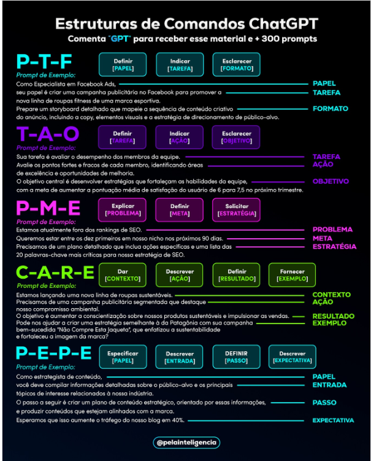

<h1>Tecnica de engenharia de prompt</h1>

prof: Aline Antunes - tech education analyst

<h2>conhecendo o prompt</h2>

<b>O que é um prompt</b>

prompt - uma instrução, fornecida para que um IA realize uma tarefa específica

ex: Explique o que seria um prompt no contexto de IA

IA lê o prompt, analisa sua "biblioteca" a base que foi trienada, e depois retorna a resposta

seria o "input"

<b>Importãncia de um prompt</b>

Ponte entre o que o usuário quer fazer e o que o sistema deverá realizar

Com prompt o sitema entendo o que pesquisar e como retornar os dados

"chave" para obter respostas adequada

<b>Como is prompts transformam interações</b>

ex: assitente de voz, Alex, e o usuário pede para que ela toque um música relaxante, de um estilo de música de tal compositor

ex: lembrete para beber água, de tantas e tantas horas, etc

<b>Principais aplicações dos prompts</b>

Estão em diversos contexto como Educação, Pesquisas, Tecnologia ( Desenvolvimentos de software, Testes automatizados, Prototipagens), Negócios, Marketing, Design, Automação de atendimento, Ciências, Serviços jurídicos ... 

<h2>Componentes de um prompt</h2>

<b>Introdução</b>

Partes que compõe os prompts

Introdução - comando simples

ex: escreva uma introdução para boeltom infromativo da empersa Contoso, mencionando os esforços da equipe nestes meses difíceis e expectativas para o próximo trimestre

observação

<b>Exemplos - few-shot learning</b>

Tecnicas para treinat ou adaptar modelos de linguagens atarefas específicas com pouco ou nenhuma inform ação adional

<u>Zero shot </u>- relaizar tarefa sem estar explicitamente treinado para tarefa - modelo usa conhecimento pré existente da base

ex: Classifique os entimetno do texto ; "eu amo este produto!"

Observe que não há exemplo da forma de retorno da resposta

<u>few-shot</u>

ex: Tarefa: classificaro sentimento de um texto
neste modelo: 
-"Eu não gostei do produto" -> negativo
-"Adorei o produto"-> positivo
-"Nem fede nem cheira" -> neutro
Classifique o sentimento dest etxto "Eu adoro esta praia" 

<b>Contexto ou configuração</b>

Passar contexto para o modelo

ex: Você é um guia de turismo explicando São Paulo, capital, apara os visitantes, estão no centro da cidade,  destacando arquitetura e tradições

A resposta é mais direcionada

<b>Restrinções ou Limitações</b>

Limites que a resposta deve seguir

ex: Formato
&nbsp;&nbsp;&nbsp;&nbsp; Quantidade de &nbsp;&nbsp;&nbsp;&nbsp; palavras
&nbsp;&nbsp;&nbsp;&nbsp; Escopo
&nbsp;&nbsp;&nbsp;&nbsp; em .py

Se não passa limitação, restinção a IA retornará conforme foi treinada, e não da forma que o usuário necessita

<b>Conteúdo principal</b>

A parte do texto que possui dados aos quais o modelo deve realizar a tarefa, ele é um foco

Pode ser texto, linha, pergunta, etc

Geralmente é um combinado de instruções e a tarefa, precisando responder:

- Sobre o que ou com que base deve o modelo deve atuar

ex: Traduzir para o francês a farse "Como chegar ao museu?"

ex: (aqui é a instrução) Lite três idéias criativas para um evento comunitário: 
(conteúdo principal) evento deve engajar pessoas de todas idadades e promover sustentabiliadde

<b>Indicações</b>

Guia respotas para que seja mais adequado ao que se deseja

ex: resumo e-mail abaixo em  formato de lista
...< aqui vai email >

fomatos - listas, resumo, código ...

Evita ambiguidade

<b>Fomato de saída</b>

Como deve estrutura resposta conforme formato ou estilo

ex: Explique benefícios de utilizar framework de .java listando 3 vantagens

ex: Crie um imagem com cachorro caramelo

ex: em tópicos, json, cód em .py, .md, forma de parágrafos explicativos, com exemplos práticos, gráfico, respostas simples, etc

Indicação ela se refere a direção que aponta a algo específico como recomendações
Formato de saída é a saída dos dados

Pedir o tom é formato de saída como:

ex: Explique o que é lógica de programação como se eu fosse um criança

ou de forma técnica ...

<b>Conteúdo de suporte</b>

Dados extras que ajudam a tarefa

ex: Use o contexto atual de 2026 nas respostas

ex: Categorias importantes: entrada, prato principal e sobremesa. Liste sugestões cara cada categoria

<h2>Técnica de engenharia de prompt</h2>

<b>IUntrodução as técnicas de eng prompt</b>

Engenharia de promt é todo processo estratégico para criar, ajudatr e otimizar os prompts, obtendo respostas mais justas e certeiras

Pensar no prompt como uma conversa

<b>Aplicando Intruções e repetição</b>

Intrução clara é atecnica de organizar as orientação, de forma objetivas e detalhas, sem ambiguidade, sem texto muito logos, sem dados desnecessários

Ex: Ajude a criar uma proposta de jogo narrativo, chamado "Jo"
O jogo será de aventura onde os jogadores tomam decisões que afetam o desenrolar da istória
//
O jogo deve incluir
- introdução a istória
- principais mecânicas do jogo
- uma descrição do nosso público alvo

//
revisar e lembrar,após a geração, a propósta de "jo" para garantir que ela inclua todas as seções: istória, mecânica, público alvo

Ténicas usadas <u> Aplicando  intruções e repetições | repetindo instrução no final</u>

<b>Entendendo o Guardrails</b>

Limita as infromações para que retornem apenas dados relevantes

ex: a proposta do jogo deve ser fácil e simples de implementar em um jogo básico, evite mecânicas complexas ou irreais

Ex: gpt tem um guardrails que não permite criar determinados conteúdos pensando em segurança, direitos autoriais,pornografia, padrões éticos...

<b>Preparando nossa saída</b>

Como o modelo deve entregar a respostas

ex: Organize a aproposta no seguinte formato:
&nbsp;&nbsp;&nbsp;&nbsp;&nbsp;&nbsp;nome do jogo
&nbsp;&nbsp;&nbsp;&nbsp;&nbsp;&nbsp;instrodução da história
&nbsp;&nbsp;&nbsp;&nbsp;&nbsp;&nbsp;mecânicas
&nbsp;&nbsp;&nbsp;&nbsp;&nbsp;&nbsp;público alvo
&nbsp;&nbsp;&nbsp;&nbsp;&nbsp;&nbsp;estilo gráfico
&nbsp;&nbsp;&nbsp;&nbsp;&nbsp;&nbsp;conclusão

Aqui irá retornar em tópicos

<b>Solicitação de cadeia de pensamento</b>

* para querer estudar algo, esta ténica é boa

Responder passo a passo, explicando o raciocíneo para chegar em algo

ex: Explique por que as mecânicas são interessantes para o público alvo e como elas se alinham ao tema da aventura

ex: Explique o passo a passo, esplique detalhadamento, faça do processo de tal framework

<b>Esperando a estrutura de saída</b>

Definir forma exata da saída, estrutura de respotas

Ex: Crie a proposta do jogo no formato de tópicos

ex: Crie a proposta do jogo no formato de texo corrido

ex: Cria a proposta para gitGhub e em formato de .md (markdown)

<b>Dividindo a tarefa</b>

Quebrar problema em etapas menores e mais simples - resolver uma etapa por vez

ex: Descreva a introdução da istória
Inicie com jogador acordando em lugar misterioso
...(roda)
Agora criei o cenário da cidade..

<b>Add sintaxe clara</b>

ex: formate a proposta do jogo em uma tabela para apresentação rápida

<b>Aplicando prompts para gerar img com microsoft copilot</b>

Ex: Crie imagen de uma ilha misteriosa, com árevores sombrias, estilo pixel arte, cenários de jogos

se stiver complicado, gere em inglês, pode ajudar, pois seu trinamento mor é em inglês

ex: gere um personaem femini, em estilo pixel art para um jogo. Cabelos verdes, cacheados, pele rosa, 

