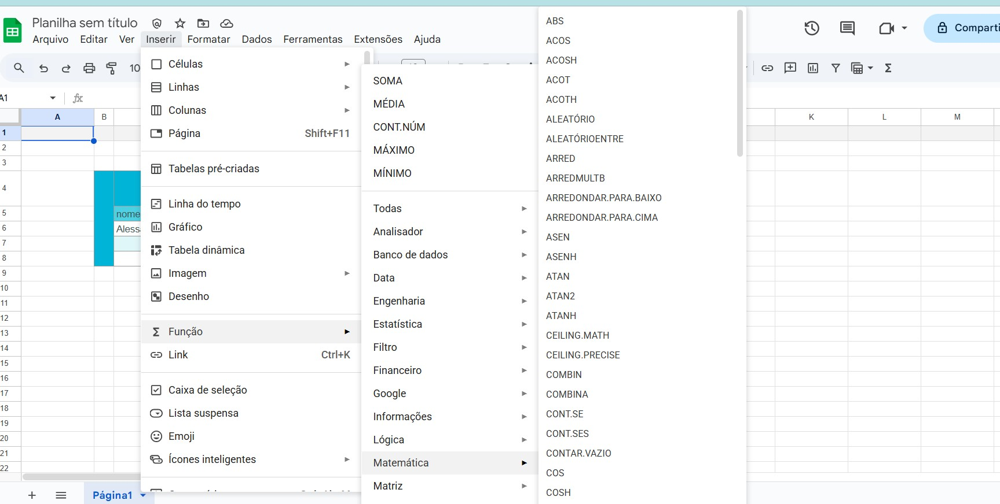
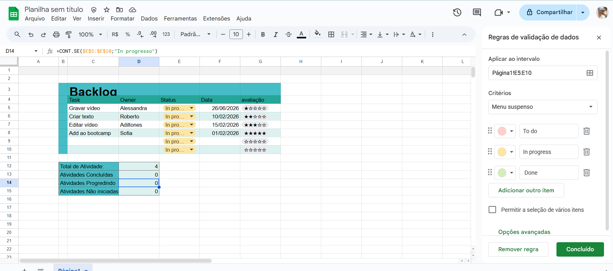
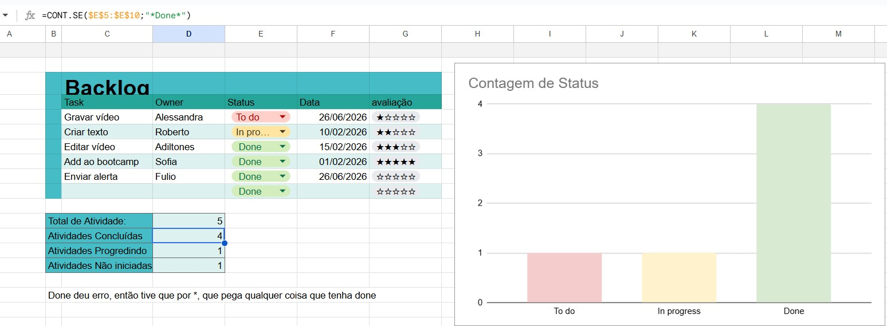

<h1>Excel</h1>

vagas.com

- analista MIs - agente que gerencia infromações de sistemas
- analista de planejamento

<h3>Vocabulário</h3>

<b>workbook/database</b> - arquivo de planilha
<b>sheet/worksheet/table</b> - aba,  local para criar as planilhas
<b>spreadsheet</b> - nome genérico - planilha
<b>cells/value</b> - células, encontro de coluna e linha
<b>columns</b> - colunas
<b>row</b> - linhas
<b>header/columm name</b> - cabeçalho
<b>row/record</b> - registro
<b>dados</b> - data
<b>range</b> - intervalo entre as cells 
<b>b1:b10</b> - usa SHIFT -  vai da 1 até a 10 
<b>b1;10</b> - usa CTRL - pega apenas as cells selecionadas, no caso apenas a 1 e a 10

extensão do excel é <b>xlsx</b>

<h3>atalhos</h3>

<b>F2</b> <u>Editar célula </u>ativa e colocar o ponto de inserção no final do conteúdo
<b>Shift F2</b> <u>Inserir uma anotação ou abrir </u>e editar uma anotação de célula.
<b>Ctrl ;</b> Inserir data atual
<b>Ctrl :</b> Inserir a hora atual
<b>Ctrl X</b> Mover as células selecionadas.
<b>Ctrl C</b> Copiar as células selecionadas.
<b>Ctrl V</b> Colar
<b>Ctrl Shift V</b> Cola especial - só valores ("deleta" a fórmula e "cumba" o valor)
<b>Ctrl Alt V</b> Cola especial - só a formatação
<b>Ctrl Shift ~</b> Aplique o formato de número Geral.
<b>Ctrl Shift $</b> Aplique o formato Moeda com duas casas decimais (números negativos entre parênteses)
<b>Ctrl Shift %</b> Aplique o formato Porcentagem sem casas decimais.
<b>Ctrl Shift #</b> Aplique o formato Data com o dia, o mês e o ano.
<b>Ctrl Shift !</b> Aplique o formato Número com duas casas decimais, separador de milhares e sinal de subtração (-) para valores negativos.
<b>F7</b> Verificar a ortografia na planilha ativa ou no intervalo selecionado.
<b>Ctrl Alt T</b> Exiba a caixa de diálogo Criar Tabela.
<b>Tecla Tab</b> Mover uma célula para a direita em uma planilha. Ou, em uma planilha protegida, mover entre células desbloqueadas.
<b>Ctrl Page down</b> Mover para a próxima planilha na pasta de trabalho.
<b>Ctrl Home</b> Mover para o começo de uma planilha.
<b>Ctrl Shift End</b> Expandir a seleção de células até a última célula usada na planilha (canto inferior direito).
<b>Ctrl F1</b> Expandir ou recolher a faixa de opções.
<b>Alt W</b> Abrir a guia Exibir e visualizar quebras de página e layouts, mostrar e ocultar linhas de grade e títulos, definir a ampliação do zoom, gerenciar janelas e painéis e exibir macros.
<b>Alt A</b> Abrir a guia Dados e conectar, classificar, filtrar, analisar e trabalhar com dados.
<b>Alt M</b> Abrir a guia Fórmulas e inserir, rastrear e personalizar funções e cálculos.
<b>Alt P</b> Abrir a guia Layout da Página e trabalhar com temas, configuração de página, escala e alinhamento.
<b>Alt N</b> Abrir a guia Inserir e inserir Tabelas Dinâmicas, gráficos, suplementos, Minigráficos, imagens, formas, cabeçalhos ou caixas de texto.
<b>Alt H</b> Abrir a guia Página Inicial e formatar texto e números e usar a ferramenta Localizar.
<b>Ctrl 0</b> Ocultar as colunas selecionadas.
<b>Ctrl 9</b> Ocultar as linhas selecionadas.
<b>Alt+H, D, C</b> Excluir coluna.
<b>Ctrl B</b> Negrito
<b>Ctrl I</b> Itálico
<b>Ctrl u</b> Undescore, sublinhado
<b>Ctrl Shift L</b> Alinhar a Esquerda - left
<b>Ctrl Shift R</b> Alinhas a Direita - right
<b>Ctrl Shift E</b> Alinhas ao cEntro - center
<b>Ctrl \ </b> limpar formatação
<b>Ctrl C</b> Seleciona cell
<b>Ctrl R</b> Copia a cell que está ao lado esquerdo

<h3>Condelar  fóruma </h3>

ex: 
=D4* E4 aqui, ao pasar para próxima linha, ficará =D5*E5
Se for para outra coluna ficará =<b>E</b>4*F4

=<b>$</b>D4* E4 aqui, ao pasar para próxima linha, ficará =D5*E5
Se for para outra coluna ficará =<b>D/</b>4*F4
- bloqueia a coluna, mas a linha fica livre

`=$D$4*E4` aqui, ao pasar para próxima linha, ficará =D4*E5
Se for para outra coluna ficará =<b>D/</b>D4*F4
- bloqueia linha e coluna, fica sí em um cell

<H3>Observação</h3>

Mudar cor ddo gráfio, é só, no gráfico selecionar o locar, coluna, que quer mudar a cor

