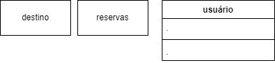
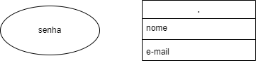
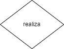
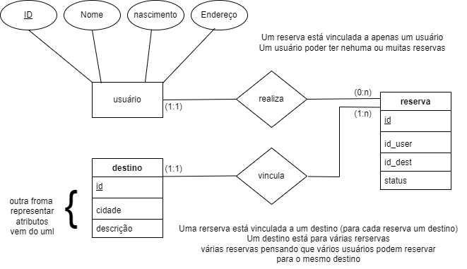

<h1>Conceitos básico e Estrutura do banco de dados</h1>

github- github.com/pamelaborges/dio-bd-relacional

<h3>banco de dados</h3>

Coleção organizada de infromações ou dados

Possui ssitema de consulta de dá fácil acesso à infromação

<u>Relacionais/ SQL</u>

<u>Não relacionais / NoSQL/ NotOnlySQL</u>

<u>Orientados ao objeto</u>

<u>Hierárquico</u>

<h3>SGBD - Sistema de Gerenciamento de Banco de Dados </h3>

<u>Funcionalidades</u>

C REATE escrita
R EAD leitura
U PDATE atualização
D ELETE exclusão

<u>Estrutura</u>

Database = local onde ficará amarxenadas as tabelas

column - coluna - definição de estados
row - linhas, tuplas - infrom ações em sí, registro
tables - tabelas

pk - primary key - chave primárias
fk - foreign key - chave estrangeira

<u>Características</u>

- Relacionamento entre tabelas
- Linguagem de consuta Estruturada (SQL)
- Intwegridade refencial
- Normalização de dados
- Segurança
- Flaxibilidade e extensibilidade
- Suporte a transações ACID (garantia da consistência da infirmação dentro do bd)

<u>ACID</u>

A ATOMICIDADE garante que todas as operações de uma transação seja executadas com sucesso ou que nenhuma seja executada. Se uma falhar a outra será revertida ao estado anterior
C ONSISTÊNCIA garante que o bd seja de um estado consistente a outro consistente
I SOLAMENTO cada transação é feita de froma isolada, para mater consistência do dado, cada transação será feita por vez
D DURABILIDADE uma vez que a transaçao seja confirmada, ela será "fixada" - commitada

referência = www.oracle.com.br/br/database/what-is-a-relational-database/

<h3>Introduçao e conceitos básicos SQL</h3>

Linguagem de consuta padronizada - Structured Query Language

1970 foi seu surgimento

<u>Tipos de declarações</u>

- DQL SELECT  Linguagem de Consulta Dados <i>Data Query Language</i>. Recupera infromação
- DML INSERT, UPDATE, DELETE  Linguagem de Manipulação Dados <i>Data Manipulation Language</i>
- DDL CREATE, ALTER, DROP  Linguagem de Definição Dados <i>Data Definition Language</i>. Estrutura onde será criada a tabela, como a tabela será,etc..
- DCL GRANT, REVOKE Linguagem de Controle Dados <i>Data Control Language</i>
- DTL BEGIN, COMMIT, ROLLBACK  Linguagem de Transação Dados <i>Data Transaction Language</i>

<u>Sintáxa básica - pode mudar confrome bd</u>

- Os nomes DEVEM começar com uma letra ou com um caractere de underscore (_)
- Pode ser case sensitve (no geral é case sensitive)
- Os nomes podem conter letras, n°s e caracteres subçinhado

referência = www.sqltutorial.org/

<u>MER e DER - modelagem de banco de dados</u>

<b>MER</b> Modelo Entidade-Relacionamento / Modelo Entidade-Relacionamento

Representa estrutura geral, sem entrar em muitos detalhes 

- entidades
- atributos (infromações)
- relacionamento entre entidades

<b>DER</b> Diagrama Entidade-Relacionamento / Entity-Relationship Model

- representação gráfica do modelo
- mostra:
&nbsp;&nbsp;&nbsp;&nbsp;- entidades
&nbsp;&nbsp;&nbsp;&nbsp;- atributos
&nbsp;&nbsp;&nbsp;&nbsp;- relacionamentos
&nbsp;&nbsp;&nbsp;&nbsp;- cardinalidades

link para desenvolver o diagra = app.creately.com/

<b>Entidades</b>

- noemadas com subtantivos concretos ou abstratos
- nome deve repersentar de forma clara suas função
- símbolo retângulo

<b>Atributos</b>

- características ou propriedades das entidades
- descreve infrimações específicas
- não poder ser atributo composto
- símbolo oval

<b>Relacionamento</b>

- como entidades relacionam entre sí
- conexão se dá por linhas

<b>Cardionalidade</b>

- relacionamento entre "quantidades de entidas"

0,n   nenhuma ou uma entidade para outras entidades - um usário pode ter tenhuma, uma, ou mais de uma reserva
1,1 um entida para outra entidade - um enfermo pode ter apenas um leito
1,n ou 1,*  uma entidade para outras entidades - um enfermo pode ter um ou mais médicos
n..n ou  * .. *  entidades para outras entidades - 

Ia para gerar diagramas = www.quickdatabasediagrams.com/

