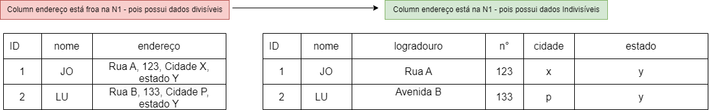
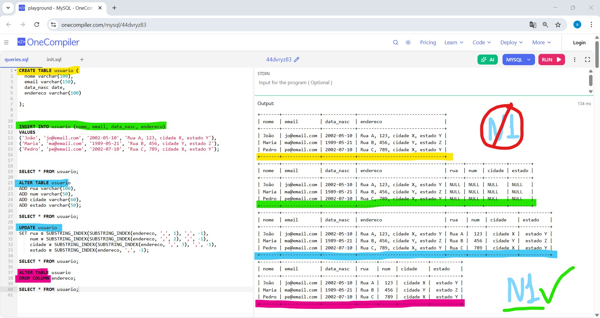
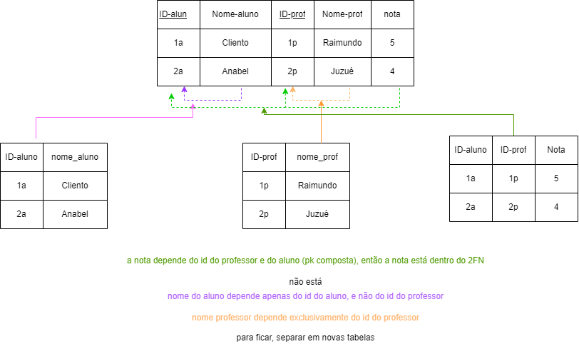

<h1>Normalização de Dados</h1>

| id | Nome | Enderço |
| :--- | :---: | :---:|
| 1 | João | Rua A, 123, Cidade X, Estado Y |
| 2 | Maria | Rua B, 456, Cidade Y, Estado Z |
| 2 | Duvalda | Avenida C, 789, Cidade X, Estado Y |

O Usuário pode poder o endereço de várias fromas, para não correr isso deve-se normalizar os dados

Normalização de dados - processo que organiza ee strutura um bd relacional de forma a <i> eliminar redundãncia e anomalias</i>, garanbtindo a consistência e integridade dos dados
Feito na fase de definição e modelagme

<h3>Formas Normais </h3>

- <b> 1FN </b> Atomicidade de dados

&nbsp;&nbsp;&nbsp;&nbsp;&nbsp;&nbsp;&nbsp;&nbsp;&nbsp;&nbsp;- cada valor de uma tabela deve ser atõmico / INDIVISÍVEL 
&nbsp;&nbsp;&nbsp;&nbsp;&nbsp;&nbsp;&nbsp;&nbsp;&nbsp;&nbsp;- Nenhum campo deve conter múltiplos valores ou listas (ex: coluna enderço da tabela acima)
&nbsp;&nbsp;&nbsp;&nbsp;&nbsp;&nbsp;&nbsp;&nbsp;&nbsp;&nbsp;- <u> DEVE tratar, divir o campo endereço </u>

comando SQL

https://onecompiler.com/mysql/44dvryz83

- <b> 2FN </b> 

Todos os atributos não chave primária DEVEM  depender <b> TOTALMENTE </b> da pk (primary key)

<u>pk simples </u>- composta por uma única chave, ex id

<u>pk composta </u>- composta por mais de uma chave, ex cpf e nome_mae

- <b> 3FN </b> 

Nenhuma coluna não chave depende de outra coluna não chave

ex: cidade está dependente do estado

