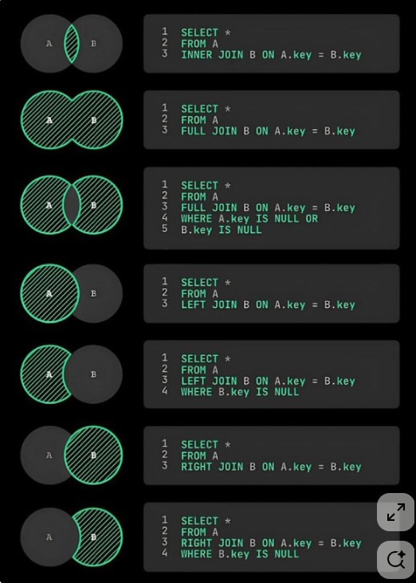

<h1>Consulta avançada</h1>

*https://kr.pinterest.com/pin/530861874849309374/*

JOIN  - junção  com bina dados de duas ou mais tabelas relacionadas em um única consulta

INNER JOIN /    - INNER JOIN table-dentino ON table-origem.colum = table-destino.column  - retorna apenas as linhas que têm correspondência em ambas as tabelas
Condição de igualdade
Geralmente usa como referência o id

ex:

SELECT * FROM usuario us
INNER JOIN reserva rs ON us.id = rs.id_user
INNER JOIN destino ds ON rs.id_destino = ds.id;

<i>Caso em que o dados não irão vir completo

Add um usuário apenas na tabela usuario e, este não ter relação com as outras
ao fazer o join ele não irá aparecer na tabela de pesquisa

ex:
INSERT INTO usuario (nome, email, data_nasc, rua, num, cidade, estado)
VALUES
    ('sem reserba','dio@gamil.com','1992-12-30','rua','12','cidade','estado');

SELECT * FROM usuario us
INNER JOIN reserva rs ON us.id = rs.id_user
INNER JOIN destino ds ON rs.id_destino = ds.id

Neste caso a tabela virá sem este novo user
</i>

LEFT JOIN / LEFT OUTER JOIN   - junção  retorna as linhas à esquerda da junção e as linhas correspondentes da linha direita, o que não tem comparação retona NULL

ex:

SELECT * FROM usuario us
LEFT JOIN reserva rs ON us.id = rs.id_user
LEFT JOIN destino ds ON rs.id_destino = ds.id;

RIGHT JOIN / RIGHT OUTER JOIN  - junção  mesma coisa que o left, mas a da direita que é a "tabela base"

ex:

SELECT * FROM usuario us
RIGTH JOIN reserva rs ON us.id = rs.id_user
RIGTH JOIN destino ds ON rs.id_destino = ds.id;

FULL JOIN / RIGHT OUTER JOIN  - junção  retorn todas as linhas de ambas as tabelas envolvidas na junção, se não tiver correspondência os valore serão nulos

ex:

SELECT * FROM usuario us
FULL JOIN reserva rs ON us.id = rs.id_user
FULL JOIN destino ds ON rs.id_destino = ds.id;

<h3>Sub consultas</h3>

Permitem realizar consultas mais complexas permitindo que vc use o resultado de uma consulta como entrada para outra consulta

podems ser usadas em:
- SEELCT
- FROM
- WHERE
- HAVING
- JOIN

ex:

SELECT * FROM destino
WHERE id NOT IN (SELECT id_destino FROM reserva)

só ids que não está na 1° consultas, os quenão tem reservas

SELECT * FROM destino
WHERE id NOT IN (SELECT id_destino FROM reserva)

outra forma

SELECT nome, (SELECT COUNT (*) from reservas WHERE  id_user = user.id ) AS total_reservas
FROM usuarios

criou um tabela total reservas com nome e quantidade de reservas