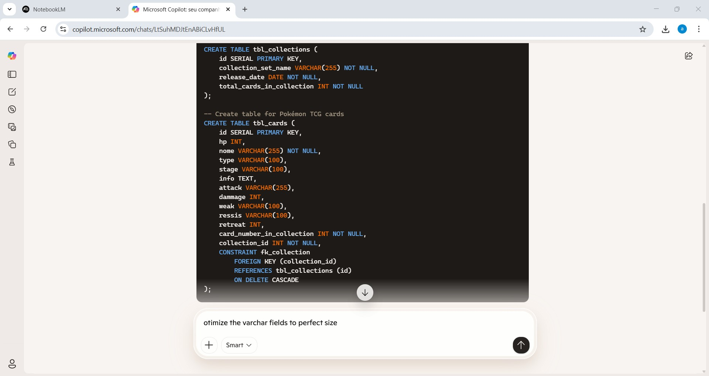

<h1>Copilot</h1>

pré requisitos:

- SQGB - postgres usado pelo professor
https://onecompiler.com/postgresql
- copilot gratuíto
- ide vscode

<b>contrução</b>

seeds - valores iniciais da tabela

<h3>conectando sql server o vscode</h3>

migration

powershel - .ps1

criar arquivo de imigration que lerá todo cód sql e lerá de uma vez

<h3>View</h3>

consulta para guardar e pode, posteriormenete selecionar

pegar modelo relacional - que está na tables (001_create_card_table.sql)

